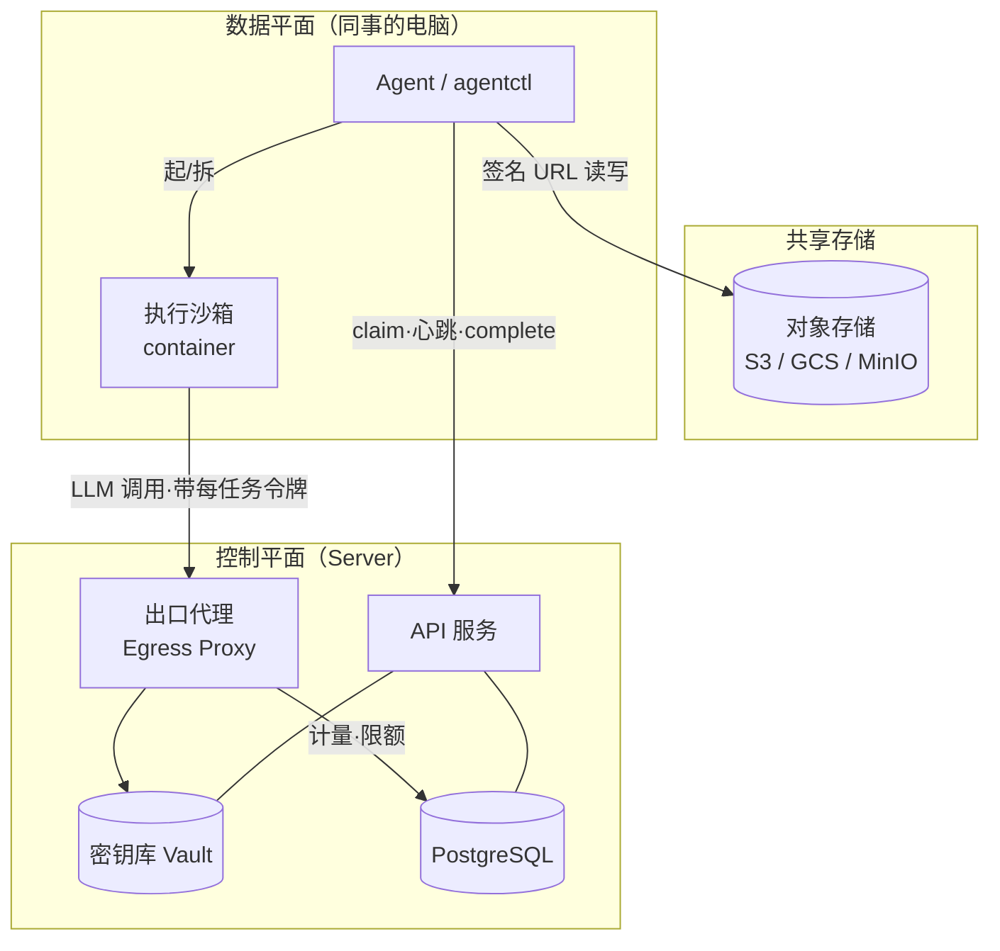
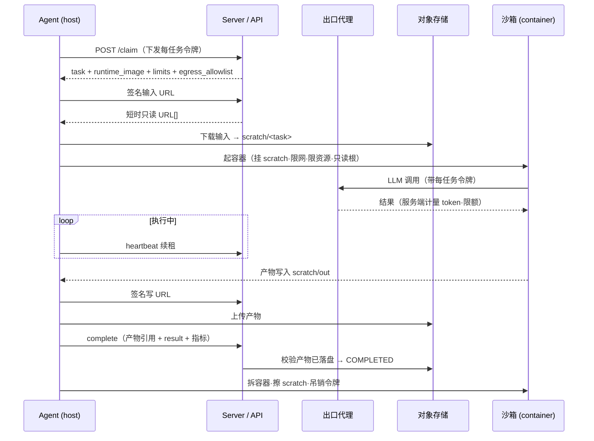

# 任务可移植性与安全执行设计

> 主设计文档第 12 节的展开。解决的是整套系统里最难的那块：**一个中心定义的任务，怎么安全地在一台任意的、半可信的个人电脑上执行，再把结果拿回来**——而且不把长期密钥落到那台机器、不依赖它本地装了什么、也不让任务代码有机会祸害宿主。

## 0. 问题与三条原则

四条管线 + 一个执行沙箱：**数据/上下文（进）**、**密钥/账单**、**环境/依赖**、**产物（出）**，外加一层**安全执行**把它们串起来并隔离不可信代码。

贯穿始终的三条原则：

1. **引用，而非字节**：payload 里只放指向共享对象存储的短时签名 URL，输入输出的实际数据都不进 payload、不长期留在机器上。
2. **代理，而非下发**：长期密钥永远留在服务端。机器需要调外部 API 时，走服务端代理或拿一把短时、任务范围、随租约过期的钥匙——它自己拿不到真钥匙。
3. **隔离，而非假设**：不假设机器本地环境就绪、也不假设任务代码可信。执行放进声明式的容器里，限网、限资源、用完即毁。

---

## 1. 架构增量

在主设计的控制平面 / 数据平面之外，新增三个服务端组件（对象存储、密钥库、出口代理）和数据平面上的一个执行沙箱：

- **对象存储**：输入 / 产物的实际字节都在这；机器上不放桶凭证，只拿服务端签发的短时 URL。
- **密钥库（Vault）**：真实的第三方密钥（LLM key 等）只在这，绝不下发给 Agent。
- **出口代理**：Agent（沙箱内）对外的 LLM/API 调用经它中转，由它注入真实 key、按项目限额、在**服务端**计量 token。

---

## 2. 数据 / 上下文（进）：引用而非字节

- 大输入（文件、数据集、私有仓库的**快照 tarball**、上下文包）预先放对象存储。任务的 `inputs` 字段只存对象键。
- 领取时（或单独一次 `inputs:sign` 调用）服务端签发**短时、只读、限定到这些键**的 URL。Agent 把输入下到 `./scratch/<task_id>/`——一次性目录，任务结束即 `rm -rf`。
- 仓库优先用**快照 tarball** 而非让机器去 clone 私有仓库：更 hermetic，也免得把仓库读权限暴露到一堆机器上。真要实时 clone，就发一把短时、只读、限定单仓库的 token。
- 好处：payload 小；敏感数据不在笔记本上长期落盘；谁在什么时候取了什么可审计。

---

## 3. 密钥 / 账单：代理 + 短时凭证（本设计的核心）

**长期密钥永不下发到机器。** 两种模式：

### 模式 A — 出口代理（LLM 调用及计费首选）
沙箱内的任务**通过服务端代理**发起模型调用，认证用的是这次任务的**每任务令牌**。代理负责：注入真实 API key、按 项目 / 任务 强制**花费上限**、并在**服务端精确计量 token 与成本**。

这一步一箭双雕：

- **账单归属清楚**：用项目的 key，中心化计量、封顶；Agent 全程看不到真 key。
- **顺带修好了"自报 token 不可信"**：token / 成本是在代理处**测量**的，不是机器自报的——这跟"砍掉打分"是两件独立的事，即便没有打分，这一层也把最关键的计量指标变可信了。

### 模式 B — 短时范围凭证（代理覆盖不了的第三方 API）
代理管不到的调用，由 `credentials` 端点铸造一把**短时、限定到本任务所需范围、随租约过期、完成即吊销**的凭证，运行时**只注入到沙箱环境变量**、不落盘、结束擦除。

每任务令牌（来自主设计的分层令牌方案）就是任务向代理 / 凭证端点证明"我是这次任务"的东西，只对这一个任务有效。

---

## 4. 环境 + 不可信代码：容器化 hermetic 执行

**不信任机器本地环境，也不信任任务代码。** 两层：

### 默认 — 容器执行
每个任务类型声明一个 `runtime_image`。Agent 在该镜像的容器里跑任务，同时：

- 挂载 `scratch/<task_id>`（读写）+ 只读的任务规格；**不挂任何宿主目录**。
- **限网**：出站只允许到出口代理 + `egress_allowlist` 里的端点（用 sidecar 代理或防火墙规则实现），堵住任意外联 / 数据外泄。
- **限资源**：CPU / 内存 / 磁盘 / 墙钟超时（超时和租约对齐）。
- **收紧权限**：只读根文件系统、丢弃 Linux capabilities、非 root 用户。

一步同时解决了两件事：**"环境就绪"**（镜像里有依赖）和**"不可信代码隔离"**（沙箱限制爆炸半径）。能力标签的含义也从"本地恰好装了什么 SDK"变成"这台机器能给容器提供什么"（gpu、大内存）。

要更强隔离可上 gVisor / Firecracker microVM（更重）；起步用 Docker/Podman + 限网 + 限资源即可。

### 退路 — 原生执行
必须用本地 GPU / 授权软件、没法进容器的任务，退回宿主原生执行：用能力标签门控放置，但**接受更弱的隔离**，并在系统里标记为低信任类型。这是明确的权衡，不是默认。

---

## 5. 产物（出）：对称的签名写

- 任务被签发一个**短时、只写、限定到 `output_prefix`**（对象存储里本任务的前缀）的 URL。
- 沙箱把产物写到 `scratch/<task_id>/out`，Agent 上传到该前缀；`complete` 调用只带**产物引用 + 小结构化结果 + 指标**。
- 服务端在转 `COMPLETED` 前**校验产物确实落到了预期的键**，并把产物关联回 task。

---

## 6. 端到端执行时序（`run` 包装）

**丢租约的处理**：执行中任一次 heartbeat 返回失效（`4`），立刻**杀容器、丢弃、不上传、不 finalize**——避免和接手的机器重复副作用。这是主设计"丢了租约就停手"纪律在有产物 / 有副作用场景下的落地。

---

## 7. 数据模型 / API 增量

在主设计的表上新增（其余不变）：

| 表 | 新增字段 | 用途 |
|---|---|---|
| `task_types` | `runtime_image`, `resource_limits{cpu,mem,timeout,disk}`, `egress_allowlist[]`, `needs_secrets[]` | 声明执行环境 / 隔离 / 限额 / 所需凭证 |
| `tasks` | `inputs[]`（对象存储引用）, `output_prefix`, `artifacts[]`（完成时填） | I/O 引用 |
| `credential_grants`（新表） | `task_id, kind, scope, issued_at, expires_at, revoked_at` | 短时凭证审计 |

新增 / 扩展端点：

| 端点 | 作用 |
|---|---|
| `POST /tasks/{id}/inputs:sign` | 换取短时只读输入 URL（也可直接内联在 claim 响应里） |
| `POST /tasks/{id}/outputs:sign` | 换取短时只写产物 URL（限定 `output_prefix`） |
| `POST /proxy/llm`（及其它 `/proxy/*`） | 出口代理：注入真实 key、限额、服务端计量 |
| `POST /tasks/{id}/credentials` | 铸造短时、任务范围、随租约过期的凭证（模式 B） |
| `POST /tasks/{id}/complete` | 扩展：带 `artifacts[]`；服务端校验落盘后才转 COMPLETED |

---

## 8. （可选）结果校验：复制 + 表决

砍掉打分去掉了刷分动机，但个别关键任务你可能仍想要一点"结果是真的"的信心。借 BOINC 的做法：对被标记为**关键**的任务类型做**复制**——用主设计的扇出 / delivery 机制把同一任务发给 N 台机器，比对 / 取多数（canonical result）后才接受。代价是 N 倍算力，只对少数任务开。这是对"结果不可信"的正面处理，比信任自报分数干净。

---

## 9. 权衡与分阶段采纳

**权衡**

- 容器隔离要求机器上有 Docker/Podman——对可信团队可接受；要极强隔离用 microVM（更重）。
- 出口代理是杠杆最高的一块（账单 + 计量 + 密钥收口），但它是一跳延迟 + 潜在瓶颈 / 单点，要做水平扩展和超时兜底。
- 原生 fallback 牺牲隔离换能力（GPU / 授权软件），按能力门控并标低信任。
- 对象存储引用需要一个大家都能通过签名 URL 访问的共享桶（机器上不放桶凭证）。

**分阶段（按收益 / 成本排序，不必一次做完）**

1. **对象存储引用 I/O + LLM 出口代理**——收益最大、对机器要求最低：一步修好账单归属、token 计量可信、密钥收口。
2. **容器化 hermetic 执行 + 限资源 + 限网**——修"环境就绪"和"不可信代码"。
3. **非 LLM 第三方 API 的短时凭证 + 每任务令牌吊销 + 审计表**。
4. **（可选）关键任务类型的复制 / 表决校验**。

---

## 附：这份设计修了哪些缺陷

- **任务可移植性（#1）**：四条管线（数据 / 密钥 / 环境 / 产物）全部给出可落地设计。
- **不可信代码在个人电脑上执行**：容器隔离 + 限网 / 限资源 + 原生 fallback 门控。
- **自报 token / 成本不可信**：出口代理在服务端计量——独立于"砍掉打分"，把最关键的计量指标变可信。
- **密钥下发 / 账单归属不清**：代理 + 短时凭证，长期密钥不落机器，项目 key 中心化计量并封顶。
- **（可选）结果不可信**：关键任务复制 + 表决。
