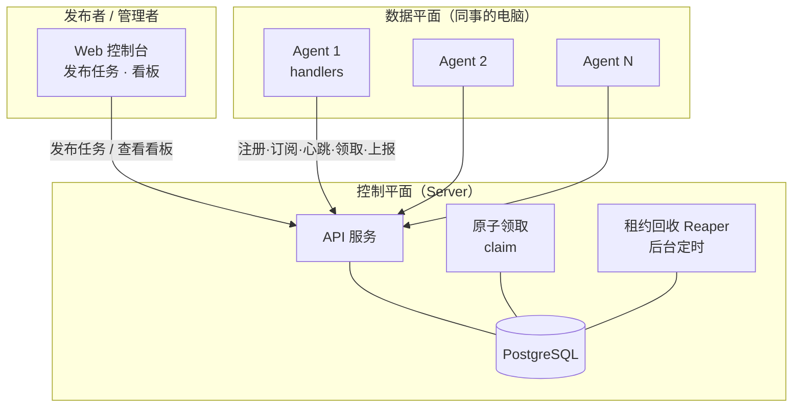
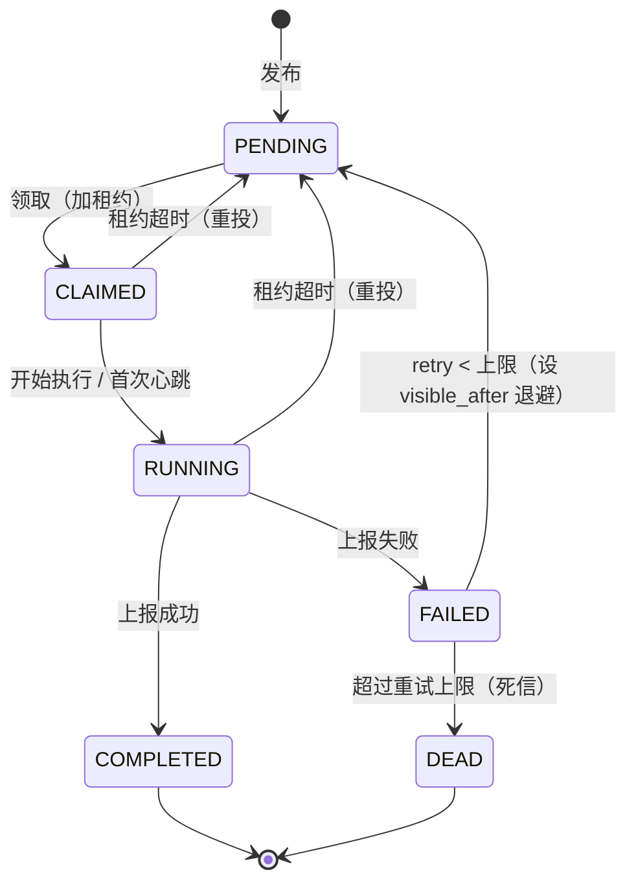

# 分布式 Agent 管理系统设计（v2 · 无打分 + FIFO）

> 一句话：把它当成一个**基于 PostgreSQL 的拉取式任务队列**。Project = Topic，Task = Message，Agent = Consumer，Group = Consumer Group；Agent 用定时任务（schedule task）**主动拉取**任务，跑完上报结果与 token 消耗。**分配是 FIFO（最老的先做）+ 能力硬过滤 + 每机并发上限，不随机、不打分**；上报的数据只进看板展示，不反向影响调度。

前置假设（和实际不符就告诉我，可调整）：

- **拉模型**：Agent 跑在同事电脑上（多在 NAT/防火墙后），由 cron / launchd / 计划任务定时唤起，主动向服务端领任务。服务端不反向连接 Agent。
- **存储**：核心队列用 PostgreSQL（`FOR UPDATE SKIP LOCKED` 本身就是并发安全的任务队列，起步不需要引入 Kafka）。量大了再换 Redis Streams / Kafka。
- **默认一个 Project 一个 Group**（纯竞争消费，每个任务只被做一次）。需要"多组各跑一遍"的扇出见 Group 小节。
- **信任边界**：面向一个**互相信任的小团队**。这一点让"上报数据来自不可信机器"不再是问题——见第 2 节。

> 本文档取代早前那版"带信誉分"的设计。打分 / 信誉那一套已按下述理由整体移除。

---

## 1. 与消息队列的概念映射

| 消息队列概念 | 本系统 | 说明 |
|---|---|---|
| Topic | **Project** | 一类相关任务的流，带 payload 的 JSON schema |
| Message | **Task** | 一个具体任务，含 `type` + `payload` |
| Consumer | **Agent** | 同事电脑上的 worker |
| Consumer Group | **Group** | 一组共同消费某 Project 的 Agent |
| Offset / Ack | **Lease + 上报** | 领取=加租约，完成=ack；超时未 ack 自动重投 |

和 Kafka 的关键差别：**领取不是静态分区分发，而是 Agent 主动拉取 + 服务端原子领取（FIFO + 能力过滤 + 并发上限）**。因为 Agent 是"会休眠、会来去"的临时消费者，拉取模型天然避开了 Kafka 消费组的再平衡风暴（见第 13 节）。

---

## 2. 设计决策：为什么不做自动打分

这是相对初版最大的改动，单列说明。初版的核心是"结果打分 → 信誉分 → 领取优先级"的闭环。砍掉它有两个独立、且各自致命的理由：

- **分数信号喂不出来（不可生产）**：要驱动这个闭环，你得给相当比例的任务打上可靠分数。但现实里——大多数任务没人会去人工评分；很多 LLM 任务（摘要、草稿、调研）根本没有唯一正确答案，自动校验和 LLM-as-judge 只覆盖一小部分、且本身带噪声。信号稀疏又不可靠，闭环就是空转。
- **分数不可验证（不可信）**：token、工时、甚至结果本身，都是**跑在同事电脑上、你不完全控制的进程自报的**。一旦这些数字反过来决定"谁多拿活、谁少拿活"，就产生了刷分动机（挑 easy 任务、虚报指标），而你没有低成本手段核实。

**砍掉打分顺带解决了第二个问题**：当这些数字不再驱动任何信任 / 路由决策时，它们是不是自报的就无所谓了。看板退化为**纯展示**——对一个互信的小团队，展示"谁跑了多久、烧了多少 token、完成了什么"完全够用，不需要防作弊。

代价是失去了"自动把活往靠谱机器上倾斜"的能力。对小团队这不划算：用**能力匹配**保证正确性、用**每机并发上限**防止某台机器抢一堆活拖死，已经够了。真需要区分机器质量时，人工在看板上看数据、手动调订阅 / 并发上限，比一个喂不出信号的自动闭环更实在。

> **保留了什么**：可靠性那一套（租约 / 心跳 / Reaper / 死信 / 幂等）和打分无关，它对付的是"笔记本会休眠、会崩溃"，只要 Agent 还跑在同事电脑上就一直需要——全部保留。

---

## 3. 总体架构



三个平面：

- **控制平面（Server）**：Web + API，负责发布、原子领取、租约回收、看板。（相比初版，去掉了打分 & 信誉引擎。）
- **数据平面（Agent）**：跑在同事电脑，注册→订阅→定时领取→执行→上报。
- **存储**：Postgres 存 Agent / Project / Group / Task / 结果 / 指标。

---

## 4. 数据模型

```
agents
  id, name, owner(同事), machine_info, capabilities[](能力标签)
  api_token(注册时下发), status(online/offline), last_heartbeat_at, created_at

projects                     -- Topic
  id, name, description, task_schema(JSON Schema), created_at

groups                       -- Consumer Group
  id, name, project_id, created_at

subscriptions                -- 谁 以什么组 订了哪个 project
  agent_id, project_id, group_id
  UNIQUE(agent_id, project_id, group_id)

task_types                   -- 任务类型注册表（保证类型多样、可扩展）
  type, input_schema, required_capabilities[]

tasks                        -- Message
  id, project_id, type, payload(JSON)
  priority(可选，默认全相同；仅作次级排序), required_capabilities[]
  target_group_id(可空，指定只给某个组)
  status(见状态机), retry_count, max_retries
  assigned_agent_id, group_id, claimed_at, lease_expires_at
  visible_after(退避用：此刻之前不可被领取), dedup_key(幂等)
  created_at, completed_at

results
  id, task_id, agent_id, status(success/failure), output(JSON/产物链接), created_at

metrics                      -- 遥测(纯展示)：工时 & token
  task_id, agent_id, model
  input_tokens, output_tokens, total_tokens
  wall_time_ms, cost_usd(按定价换算), retries
```

相比初版：`agents` 去掉了 `reputation` 相关字段，`task_types` 去掉了 `scoring_rubric`，整张 `scores` 表删除，`tasks` 新增 `visible_after`（失败退避用）。

> **索引重点**：`tasks(status, project_id, created_at)`（配合 `visible_after` 条件）是 FIFO 领取的热点索引；`metrics(agent_id)` 服务看板聚合。

---

## 5. 任务状态机



- **CLAIMED/RUNNING**：持有租约 `lease_expires_at`。执行中定期心跳续租（长任务必需）。
- **租约超时**：电脑休眠 / Agent 崩溃 → Reaper 把任务退回 `PENDING` 并 `retry_count++`。
- **失败退避**：失败重投时设 `visible_after = now + backoff`，让"毒任务"不立刻回到队头反复失败、堵住后面（见第 7 节）。
- **DEAD**：超过 `max_retries` 进死信队列，在看板上人工处理（重投 / 改参数 / 换 Agent）。

---

## 6. Agent 生命周期与 schedule task 轮询

**注册**：`POST /agents/register` → 返回 `agent_id + api_token`，本地存好。声明自己的 `capabilities`（能跑哪些 task type）。

**订阅**：`POST /subscriptions`，选 `project + group`。

**定时领取**（两种部署方式，二选一）：

1. **计划任务型（推荐给同事电脑）**：cron / mac launchd / Windows 任务计划程序每隔 N 秒唤起一次 Agent 进程 → 领 1 个（或一批）任务 → 跑完上报 → 退出。**无常驻进程、天然抗崩溃**。
2. **常驻守护型**：Agent 长期运行，内部 poll loop + 指数退避。可选**长轮询**（claim 请求挂起最多 N 秒等任务）降低延迟。

轮询循环：

```
心跳/上线 → POST /claim
  ├─ 拿到任务 → 执行 handler → POST /tasks/{id}/complete
  └─ 204 无任务 → 指数退避(带 jitter，封顶如 60s) → 下轮
```

**任务多样性怎么落地**：Agent 侧是**插件 / handler 架构**——一张 `task_type → handler()` 的注册表。新增任务类型 = 服务端注册一个 type（带 input schema、所需能力）+ Agent 实现对应 handler；LLM agent 也可以直接把"读任务→干活→上报"当成 handler。领取查询用能力标签做匹配，保证只有"会做"的 Agent 才领得到。

---

## 7. 领取任务：FIFO + 能力匹配 + 并发上限（核心）

目标：**简单、确定、不饿死任务、并发安全**。一句话——**给这个 Agent 它能做的、最老的、且没让它超并发的那个 pending 任务**。由三条规则组成：

**规则 1 — 能力硬过滤（正确性，不是优化）**：只把任务给 `required_capabilities ⊆ agent.capabilities` 的机器（要 GPU 的别发纯 CPU 机、要某仓库 / key 的别发给没有的）。如果所有机器完全同质，这条可省，裸 FIFO 就够。

**规则 2 — FIFO（最老优先），不是随机**：按 `created_at ASC` 取第一个。为什么不用 `ORDER BY random()`——随机走不了索引、且可能让某个任务一直抽不中被饿死；FIFO 走索引、延迟有上界。而且 `SKIP LOCKED` 本身已经把活分散到"此刻在轮询的这批 Agent"上（A 锁住最老的，B 跳过拿下一个），跨机均摊是免费拿到的，随机相对 FIFO 没有任何额外好处。

**规则 3 — 每机在途并发上限**：`inflight(agent) >= max_concurrency(agent)` 就直接退避，防止一台机器一次抢一堆任务然后休眠、把活拖死。

### 原子领取（Postgres，并发安全）

```sql
-- 应用层先查: inflight(agent) >= max_concurrency(agent) → 直接返回 204 退避

UPDATE tasks SET
    status = 'CLAIMED',
    assigned_agent_id = :agent_id,
    group_id = :group_id,
    claimed_at = now(),
    lease_expires_at = now() + :visibility_timeout
WHERE id = (
    SELECT t.id
    FROM tasks t
    JOIN subscriptions s
      ON s.project_id = t.project_id AND s.agent_id = :agent_id
    WHERE t.status = 'PENDING'
      AND s.group_id = :group_id
      AND (t.target_group_id IS NULL OR t.target_group_id = :group_id)
      AND t.required_capabilities <@ :agent_caps                 -- 能力匹配(数组包含)
      AND (t.visible_after IS NULL OR t.visible_after <= now())  -- 跳过退避中的任务
    ORDER BY t.priority DESC, t.created_at ASC                   -- 默认 priority 相同 → 纯 FIFO
    LIMIT 1
    FOR UPDATE SKIP LOCKED
)
RETURNING *;
-- 无返回行 → 204 无任务 → Agent 指数退避
```

`priority` 默认全相同，排序退化为纯 `created_at ASC`（FIFO）；只有偶尔想插队时才用它做次级排序，不引入信誉那种复杂度。

### 失败退避（补 FIFO 的一个坑）

随机分发能天然打散重试，FIFO 不行——一个总失败的"毒任务"会卡在队头被反复领取、反复失败，堵住后面。所以失败重投时设 `visible_after = now + backoff`（如 `base · 2^retry`，封顶），让它先靠边站。很便宜，但必须有。

### （可选）组间轮询公平

如果多个 Group 竞争同一批 Agent，纯全局 FIFO 可能让高频组把低频组饿死。需要时可按 Group 轮询（round-robin）领取而非全局 FIFO——这是 Hatchet 之类 Postgres 队列的经验。起步不需要。

---

## 8. 结果上报（纯遥测 / 展示）

**上报**：

```
POST /tasks/{id}/complete
{
  agent_id,
  status: "success" | "failure",
  result: { ... },                        // 产物 / 链接 / 输出
  metrics: {
    model: "...",
    tokens: { input, output, total },
    wall_time_ms,
    cost_usd,                             // 按模型定价换算，可选
    retries
  }
}
```

服务端：**校验该 Agent 确实持有有效租约**（防止超时后旧 Agent 覆盖结果）→ 落 `results` + `metrics` → 状态转 `COMPLETED/FAILED`（失败按第 7 节退避重投或进死信）→ 更新 Agent 累计（总 token / 总工时 / 完成数）。

**没有打分、没有信誉重算。** metrics 只喂看板。工时由服务端按 claim→complete 自己算，Agent 主要报 token 和 model。因为这些数字不再影响调度，"是不是机器自报的"不影响系统正确性——但仍要求 Agent **如实报**（看板成本靠它），这是团队约定，不是系统强制。

---

## 9. 可靠性

- **租约 + 心跳**：领取即加 `lease_expires_at`；执行中 `POST /tasks/{id}/heartbeat` 续租。
- **Reaper**：后台定时扫描过期租约，退回 `PENDING`，`retry_count++`。用 Postgres advisory lock 做 leader 选举，保证只有一个 Reaper 实例在跑。
- **失败退避 + 死信**：失败设 `visible_after` 退避；超过 `max_retries` → `DEAD`，看板告警。
- **幂等**：发布带 `dedup_key`；上报带 lease token，超时后旧 Agent 的写入被拒。at-least-once 下重复投递会发生，副作用尽量做成幂等。
- **鉴权（分层令牌，借 CI runner 经验）**：注册令牌（一次性，换取）→ Agent 长期令牌 →（可选）每任务令牌；令牌可轮换 / 过期，配 IP allowlist。所有调用带 Bearer，完成时校验租约归属，注册 / 领取加限流。
- **把任务代码当不可信**：payload 是外部输入，Agent 端 handler 要按不可信数据处理（别把 payload 里的字符串当命令执行）。

---

## 10. Web 控制台 / 看板

- **Agent 列表**：完成数、总 token、总工时、成功率、能力标签、在线状态、当前在途（x / 上限）。（去掉了信誉分 / 平均分。）
- **Agent 详情**：任务历史、token 趋势、在线状态。
- **Project 视图**：吞吐、积压深度（pending/running/done）、死信队列。
- **Task 详情**：payload、结果、执行者、token；可重投 / 取消。
- **成本看板**：按 模型 / Agent / Project / 时间 维度的 token 花费；**对花费异常飙升告警**（跑飞的循环往往要到账单才发现——借 Langfuse 经验）。
- 实时更新用 WebSocket/SSE，或简单轮询。

---

## 11. Group 语义（进阶）

- **默认**：一个 Project 一个 Group = 纯竞争消费，每个任务只做一次。
- **定向路由**：Task 带 `target_group_id`，把任务只发给某个组（如 `gpu-agents` 组 vs `cpu-agents` 组，或 team-A / team-B）。
- **扇出（多组各跑一遍，用于冗余 / 投票 / 多流水线）**：发布任务时为每个订阅组生成一条 **delivery** 记录，Agent 领的是 delivery 而非原始 task——组间独立各做一遍，组内仍是竞争消费。起步阶段不需要。
- **组间公平**：见第 7 节可选的 round-robin。

---

## 12. 任务可移植性与安全执行

队列 + 调度是这套系统里容易的 20%；真正的难点是**怎么把一个任务安全地送到一台随机同事电脑上、再把结果拿回来**。四条管线 + 一个执行沙箱：

- **数据 / 上下文（进）**：payload 只带**引用**，不带字节。大输入（文件、数据集、仓库快照）放共享对象存储，claim 时下发短时只读签名 URL；Agent 下到一次性 scratch 目录，用完即删。
- **密钥 / 账单**：长期密钥**永不下发到机器**。LLM 调用走**服务端出口代理**——Agent 用每任务令牌调代理，代理注入真实 key、按项目限额、**在服务端计量 token**（顺带把"自报 token 不可信"这个老毛病也修了）。非代理场景用**短时、任务范围、随租约过期**的凭证注入。用谁的 key / 算谁的账单：项目的 key，中心化计量与封顶，Agent 看不到。
- **环境依赖**：不信任机器本地环境。任务类型声明 `runtime_image`，Agent 在**容器里**跑（挂 scratch、限网限资源、只读根、丢能力）——一举解决"环境就绪"和"不可信代码隔离"。需要本地 GPU / 授权软件时退回原生执行，用能力标签门控并标记为低隔离。
- **产物（出）**：对称于输入——签名写 URL 指向对象存储的任务前缀，Agent 上传产物，`complete` 只带产物引用；服务端校验落盘后才转 COMPLETED。
- **安全执行包装**：`run` 把执行包成 取输入 → 起沙箱（限网 / 限资源 / 注短时凭证）→ 心跳续租 → 收产物 → **拆容器、擦 scratch、吊销凭证** → 上报；中途丢租约就杀容器、丢弃、不上传不 finalize。

> 完整设计（数据模型 / API / 架构增量、执行时序图、可选的复制校验、分阶段采纳）见配套文档 **《任务可移植性与安全执行设计》**。

---

## 13. 从开源前作借来的经验（为什么这么选）

- **Postgres 任务队列（River / Hatchet / Oban）**：事务性入队避免一类竞态；**执行期间不要占着数据库事务**（领取要快、用租约）；盯着队列表膨胀 / autovacuum；单 Reaper 用 advisory lock 选主；组间用 round-robin 而非全局 FIFO 防饿死。
- **志愿计算 BOINC（不可信机器 + 积分）**：它靠**复制 / 多数表决 + 抽查**来验证结果、防"挑 easy 任务刷分"。我们这版直接砍掉打分绕开了这类作弊面；真要验证结果质量，可对关键任务做复制 + 比对，而不是信自报分数。
- **CI 自托管 runner（Buildkite / GitHub）**：与我们的 Agent 部署几乎一致——出站轮询、不开入站端口；**分层令牌**；tag = 能力路由；并发数 = 每机上限；关机前优雅 drain。
- **Kafka（反面教材）**：静态分区消费组 + 临时 / 异构消费者 = 再平衡风暴。会休眠的笔记本正是"临时消费者"，这验证了**拉取 + 领取**（无分区、无再平衡）是对的。
- **SQS（租约手册）**：at-least-once → 重复必然发生 → 用 dedup key 幂等；可见性超时 ≈ 处理时长；长任务靠心跳续租；死信 maxReceiveCount 3–5 并保留以便重放。
- **LLM 成本可观测（Langfuse）**：provider 无关的 token / 成本核算、按 Agent / 模型 / 会话拆分、**对花费异常告警**——直接进了成本看板。

---

## 14. API 草图

| 方法 & 路径 | 作用 |
|---|---|
| `POST /agents/register` | 注册，返回 agent_id + token |
| `POST /agents/heartbeat` | 上线 / 保活 |
| `POST /subscriptions` | 订阅 project + group |
| `POST /projects` / `POST /task-types` | 建 Project / 注册任务类型 |
| `POST /tasks` | 发布任务（Web 或 API） |
| `POST /claim` | **领取**（核心，第 7 节 FIFO 算法） |
| `POST /tasks/{id}/heartbeat` | 续租 |
| `POST /tasks/{id}/complete` | 上报结果 + 指标 |
| `GET /dashboard/*` | 看板数据 |

（相比初版去掉了 `POST /tasks/{id}/score`。）

---

## 15. 技术选型

- **Server**：FastAPI / Node(NestJS) / Go 任选。
- **DB**：PostgreSQL（`SKIP LOCKED` 起步足够）；Redis 可选，用于限流 / 排行榜缓存（不再需要信誉缓存）。
- **Agent**：Python 或 Go 的小 CLI（即 `agentctl`），handler 插件架构；LLM agent 也可直接当 handler。
- **规模上来后**：队列迁 Redis Streams / Kafka，指标进时序库（如 Prometheus / ClickHouse）。

---

## 16. 建议的落地阶段

1. **MVP**：注册 + 订阅 + 发布 + `/claim`（FIFO + 能力匹配 + 并发上限）+ 上报 + 最简看板。
2. **可靠性**：租约 / 心跳 / Reaper / 失败退避 / 死信 / 幂等 / 分层令牌。
3. **任务可移植性**（第 12 节）：密钥注入、数据与产物走对象存储、环境就绪。
4. **进阶**：Group 扇出 + 组间 round-robin、成本看板 + 告警、长轮询。

> 相比初版，删掉了"信誉闭环"这个阶段——它是被移除的打分系统的落地步骤，现在不存在了。

---

## 参数速查表（可调）

| 参数 | 含义 | 建议初值 |
|---|---|---|
| `max_concurrency`（每机） | 单机在途任务上限 | 1–5（按机器能力） |
| `visibility_timeout` | 租约时长 | 按任务类型 5–30 min |
| `heartbeat_interval` | 心跳续租间隔 | 约租约的 1/3 |
| `backoff_base / cap` | 失败退避基数 / 封顶 | 2s / 5 min |
| `max_retries` | 重试上限 | 3 |
| `claim idle backoff` | 空闲轮询退避 | 2s→…→60s（带 jitter） |
